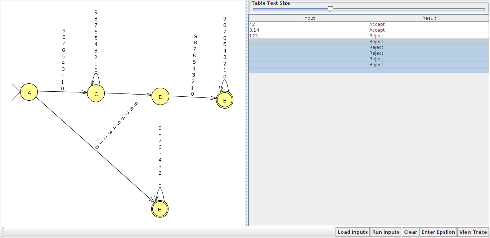
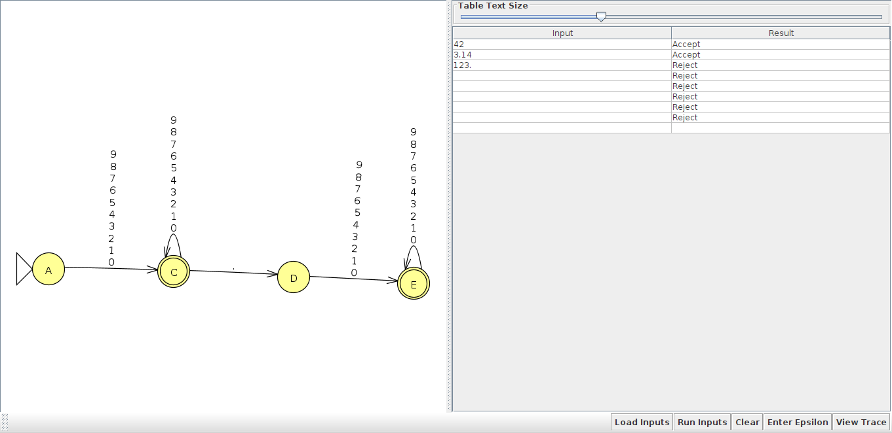
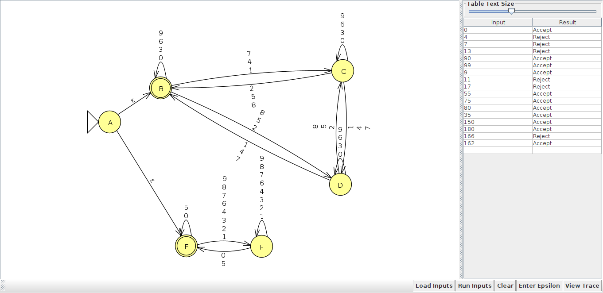
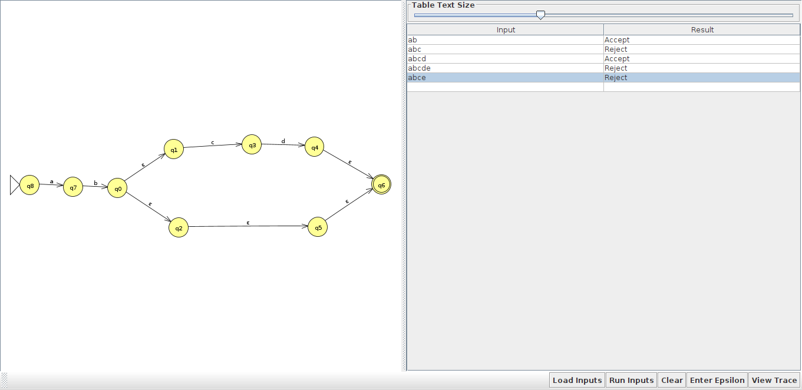
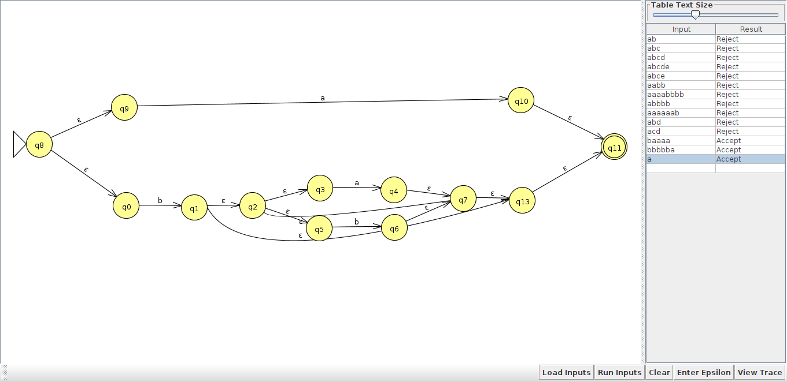
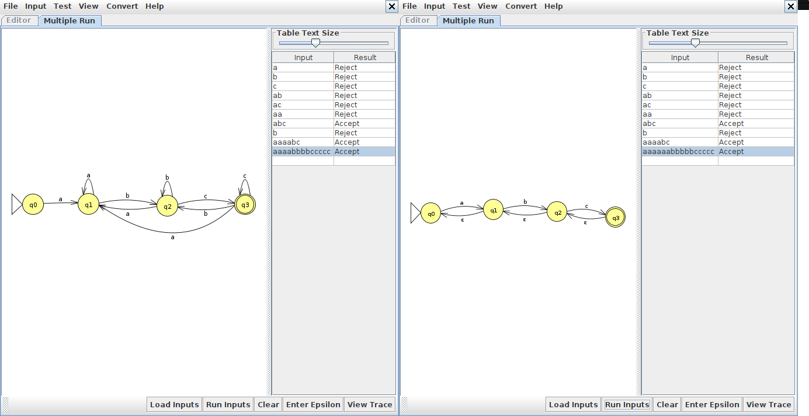

Autômatos
=========

## [dfa-repr]: Entender o mecanismo de operação de um autônomo determinístico finito

**Q1)** Crie um autômato determinístico finito equivalente às linguagens abaixo. Em cada caso, faça um diagrama de operação do autômato, enfatizando as transições, estado inicial e estados de aceite e monte separadamente a tabela de transição. 

1. Sequências de a's e b's em que os a's aparecem em pares. Ex.: aa, baab, bbb, aaaab


| f(estado) | a | b |
| :---: | :---: | :---: |
|  q0 |  q1 | q0 |
|  q1 |  q0 | q2 |
|  q2 |  q2 | q2 |
|
```
**Ex: aa:** q0(Estado inicial) -> q1 -> q0(Estado final)

```
2. Sequências de a's e b's com um número par de a's. Ex.: aa, abba, abaabbba


| f(estado) | a | b |
| :---: | :---: | :---: |
|  q0 |  q1 | q0 |
|  q1 |  q0 | q1 |
|
```
**Ex: aa:** q0(Estado inicial) -> q1 -> q0(Estado final)
```
3. Sequências de a's e b's que contenham pelo menos uma ocorrência de cada letra.


| f(estado) | a | b |
| :---: | :---: | :---: |
|  q0 |  q1 | q3 |
|  q1 |  q1 | q2 |
|  q2 |  q2 | q2 |
|  q3 |  q2 | q3 |
|
```
**Ex: ab:** q0(Estado inicial) -> q1 -> q2(Estado final)

```
Resolva 1 exemplo para demonstrar competência.


## [dfa-prog]: Implementar um algoritmo para a execução de autômatos determinísticos finitos em linguagem de programação

Resolva as duas questões para demonstrar competência.

**Q1)** Crie um programa que peça uma string de entrada para o usuário, execute o autômato determinístico finito abaixo, verifique se a string é aceita ou não pelo autômato e imprima `Aceito` ou `Rejeitado` de acordo com o resultado.


```python
def afd(delta, estado_inicial, estados_aceitacao, sequencia):
        
    estado_atual = estado_inicial    
    caminho_automato = []
    caminho_automato.append(estado_atual)
    # print('estado_atual:', estado_atual)

    for simbolo in sequencia:
        estado_atual = delta[(estado_atual, simbolo)]
        caminho_automato.append(estado_atual)

    # print('Caminho: ', caminho_automato)

    return estado_atual in estados_aceitacao
    
#---------------------------------
automato = {
        # A
        ('A','b'):'B',
        # B
        ('B','a'):'B',
        ('B','c'):'C',
        ('B','b'):'D',
        # C
        ('C','a'):'B',
        #D
        ('D','b'):'A'}
# ------------------------------

estado_inicial = 'A'
estado_final = ['D']
string_testa = input("Entre com a string: ")
resposta = afd(automato, estado_inicial, estado_final,str(string_testa))# -> True3

if resposta:
    print('Aceito')
else:
    print('Rejeitado')
```

**Q2)** Modifique uma cópia do programa da seção anterior em que o estado inicial seja B e o conjunto de estados de aceite seja {C}.

```python
def afd(delta, estado_inicial, estados_aceitacao, sequencia):
        
    estado_atual = estado_inicial    
    caminho_automato = []
    caminho_automato.append(estado_atual)
    # print('estado_atual:', estado_atual)

    for simbolo in sequencia:
        estado_atual = delta[(estado_atual, simbolo)]
        caminho_automato.append(estado_atual)

    # print('Caminho: ', caminho_automato)

    return estado_atual in estados_aceitacao
    
#---------------------------------
automato = {
        # A
        ('A','b'):'B',
        # B
        ('B','a'):'B',
        ('B','c'):'C',
        ('B','b'):'D',
        # C
        ('C','a'):'B',
        #D
        ('D','b'):'A'}
# ------------------------------

estado_inicial = 'B'
estado_final = ['C']
string_testa = input("Entre com a string: ")
resposta = afd(automato, estado_inicial, estado_final,str(string_testa))# -> True3

if resposta:
    print('Aceito')
else:
    print('Rejeitado')
```

## [nfa-repr]: Entender o mecanismo de operação de um autônomo não-determinístico finito

Resolva as duas questões para demonstrar competência.

**Q1)** O autômato abaixo representa uma linguagem que aceita números inteiros ou números com parte decimal. 


1. O que faz com que o autômato seja classificado como um NFA e não um DFA?
```
Na saida do estado 'A' serão percorrido paralelamente os estados 'B' e 'C'.
```

2. Mostre o conjunto de estados que o autômato percorre para analisar as strings: a) `42` b) `3.14` c) `123.` e diga em cada caso se a string foi aceita ou não. 
```
42 - CAMINHO: AB -> Aceito "No caminho paralelo não é aceito."
3.14 - CAMINHO: ACDE -> Aceito "No caminho paralelo não é aceito."
123. - NÃO ACEITO, é necessario que se tenha ao menos um algarismo apos o ponto.
```



3. Proponha uma mudança simples para transformá-lo em um DFA sem alterar a linguagem que ele representa.
```
O estado 'B' torna-se desnecessario quando 'C' é adicionado ao o conjunto de estados de aceite. Com essa alteração passa-se a exixtir um unico caminho.
```



**Q2)** Crie um autômato não-determinístico finito equivalente às linguagens abaixo. Em cada caso, faça um diagrama de operação do autômato, enfatizando as transições, estado inicial e estados de aceite e monte separadamente a tabela de transição. 

1. Sequências de n a's, onde n é um múltiplo de 3 ou 5. Ex.: a{12}, onde 12 = 3 x 4



```
**Ex: a{12}:** A(Estado inicial) -> B -> C -> B(Estado final)
```

2. Sequências de n a's, onde n pode ser dividido em partições de 3 ou 5 elementos. Ex.: a{13}, onde 13 = 3 + 5 + 5


```
**Ex: a{13}:** A(Estado inicial) -> B -> C(Estado final)
```

Resolva 1 dos exemplos acima para resolver a questão.


## [nfa-thompson]: Criação de NFA para representação de Regex na construção de Thompson

**Q1)** Utilize a construção de Thompson para criar um NFA-ε para as seguintes expressões regulares.

1. `ab|c`


2. `ab(cd|ε)`



3. `a*b*`


4. `a(b|c)d`


5. `b(a|b)*a|a`
```
Considerando o entendimento como: `b(a|b)*(a|a)`
```


```
Considerando o entendimento como: `(b(a|b)*a)|(a)`
```




## [nfa-epsilon]: Conversão de NFA-ε para NFA

**Q1)** O autômato abaixo representa listas de elementos formadas por sequências de a's. Responda


1. O caminho ABEF produz a string `[]`. Encontre um caminho que aceite a string `[aa,a]`.
```
Caminho ABCDCDCDEF produz a string '[aa,a]
```
2. A string `[aaa` não é aceita pelo autômato. Determine o conjunto de  **todos** estados em que autômato pode estar após receber esta entrada. 
```
1 - Um dos caminhos é ABE, fica travado em E;
2 - Outro caminho é ABCD(E)CD(E)CD(E)C

Ele possa em algum momento pelos estados ABCDE, o unico que não passa é o estado F.

Todos os estados que ele pode estar ao fim é C,D ou E.
```


**Q2)** Remova as transições ε dos dois autômatos abaixo.




## [nfa-dfa]: Conversão de NFA para DFA

**Q1)** Converta os autômatos abaixo para DFA.


Resolva dois autômatos para demonstrar competência.
```
Transformação 'A':

O estado inicial é equivalente a: A -> A,B,C

f({A, B, C},a) = {D}
f({A, B, C},b) = {E}
f({D},a) = {}
f({D},b) = {E}
f({E},a) = {C}
f({E},b) = {}
```


```
Transformação 'B':

O estado inicial é equivalente a: A -> A,B,D

f({A, B, D},a) = {B, C, D}
f({B, C, D},a) = {B, C, D}
```


